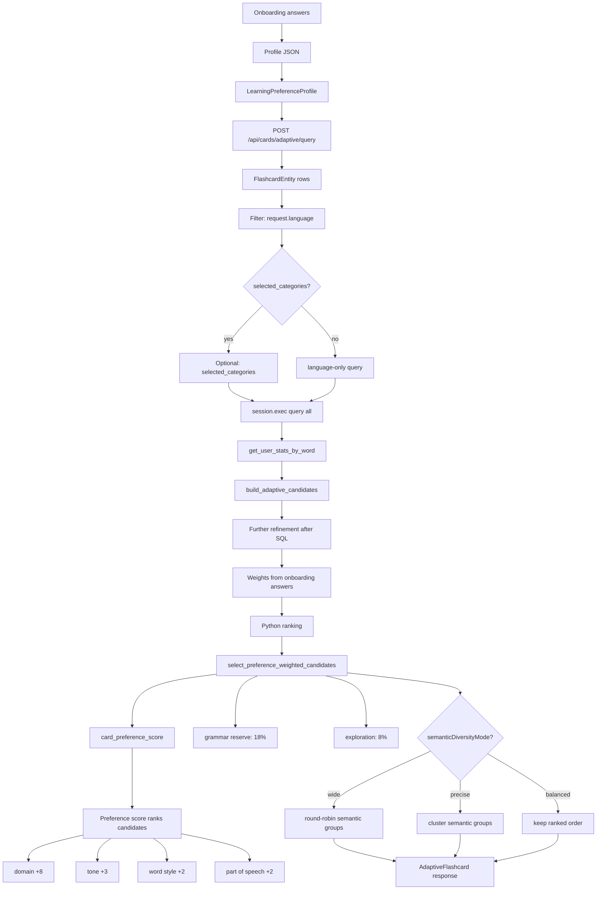

# Developer Charts

This document defines how to build and maintain `http://localhost:5173/developer`.

## Purpose

The developer route is a read-only system map for the language app. It explains the real runtime logic through Mermaid diagrams.

Developer charts are charts-only: the page may have a route header and chart titles, but implementation details must be inside Mermaid nodes or Mermaid edges.

## Hard Invariants

- Charts must match code that exists today.
- No roadmap logic in charts.
- No AI, embeddings, semantic similarity, or future inference layer unless that behavior is implemented in the repository.
- No summary chips.
- No separate fact panels.
- No duplicate overview cards before the charts.
- All implementation details must live inside Mermaid nodes or edges.
- Labels must be specific enough to map back to code.

## Source Of Truth

Before writing or changing a chart, inspect the implementation it describes:

- Frontend route: `frontend/src/App.tsx`
- Route parser: `frontend/src/routes/appRoutes.ts`
- Developer screen: `frontend/src/components/DeveloperChartsScreen.tsx`
- Mermaid renderer: `frontend/src/components/MermaidChart.tsx`
- Adaptive card endpoint: `backend/app/routes/cards.py`
- Preference scoring: `backend/app/services/preference_filter.py`
- Grammar routes: `backend/app/routes/grammar.py`
- Models: `backend/app/models.py`

If a chart cannot be traced to source code, do not add it.

## Label Rules

Avoid vague labels:

- Do not write `SQL candidates`.
- Do not write `magic filter`.
- Do not write `AI ranking`.
- Do not write `semantic similarity` unless implemented.

Use code-shaped labels:

- `FlashcardEntity rows`
- `Filter: request.language`
- `Optional: selected_categories`
- `session.exec query all`
- `get_user_stats_by_word`
- `select_preference_weighted_candidates`
- `Further refinement after SQL`
- `Weights from onboarding answers`
- `Preference score ranks candidates`
- `card_preference_score`
- `domain +8`
- `tone +3`
- `word style +2`
- `part of speech +2`
- `grammar reserve: 18%`
- `exploration: 8%`
- `semanticDiversityMode wide`
- `round-robin semantic groups`
- `semantic_group_key`

## Page Structure

The page should be simple:

1. `ScreenHeader`
2. A vertical list of `MermaidChart` components

Do not add:

- overview grids
- summary cards
- chips below charts
- text panels explaining chart details
- duplicated chart titles outside the chart list

## Mermaid Component Contract

`MermaidChart` should render:

- chart title
- Mermaid SVG
- loading state
- source fallback when rendering fails

`MermaidChart` should not render extra fact panels. If a detail matters, place it in the Mermaid source.

## Preference-Driven Learning Chart

The preference-driven learning chart must show the current implementation:

This chart intentionally does not mention AI or embeddings because they are not part of the current runtime filter.

## Testing Rules

Keep tests that enforce the invariants:

- `/developer` route exists.
- Mermaid dependency exists.
- Developer screen contains Mermaid charts.
- The page does not contain `facts`, fact panels, summary chips, or duplicate overview cards.
- Developer chart text does not mention AI, embeddings, or semantic similarity unless implemented.
- The preference chart uses specific source-code labels instead of generic labels like `SQL candidates`.
